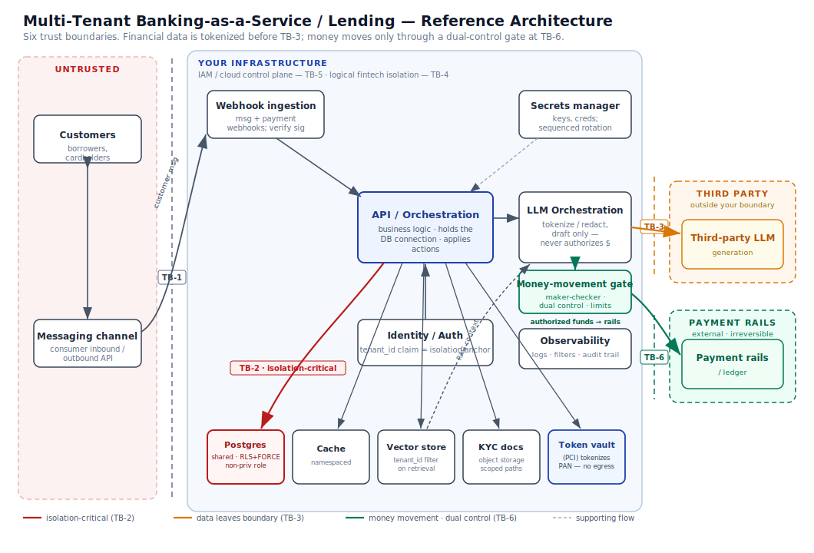

# 01 — Architecture

*Fictional reference system. See [README](../README.md) for framing. Nothing here is legal, regulatory, or financial advice.*

## 1. Purpose and shape

A multi-tenant Banking-as-a-Service and embedded-lending platform. Each **tenant** is a fintech that builds a product on the platform. Each fintech's **customers** — borrowers, cardholders, account holders — interact through a consumer channel; they never log into the platform directly. Fintech staff use a web console.

The defining architectural choice: **an LLM sits in the request path.** Customer messages, KYC documents, and application data are not just stored; they are used for support replies, document extraction, underwriting *assistance*, and dispute/fraud triage, with tenant context retrieved from a vector store. Some assistant suggestions imply **money movement** — and that is where a second design rule (§4b) becomes as important as tenant isolation.

## 2. Components

| Component | Role | Notable property |
|---|---|---|
| **Messaging channel** | Consumer inbound/outbound | Carries untrusted content — and volunteered financial data |
| **Webhook ingestion** | Receives inbound events **including payment/network webhooks**, verifies signatures, enqueues | First trust boundary; a forged/replayed payment webhook can fake a settlement |
| **API / orchestration** | Business logic; decides when to call the LLM; applies actions | Holds the DB connection — the isolation-critical component |
| **Identity / auth** | Issues tenant-scoped tokens for staff; maps channel identity → tenant | `tenant_id` claim is the isolation anchor |
| **Money-movement gate** | Maker-checker / dual control; the only path to a transfer | A **control**, not plumbing — the LLM cannot bypass it (see [AI-05](02-threat-model.md#ai-05)) |
| **Ledger / payment rails** | Records balances; connects to external card networks / banking rails | Money leaving here is **irreversible** — the highest-consequence boundary |
| **Postgres (shared)** | All fintechs, one database, Row-Level Security for isolation | Isolation depends on the *connection role*, not just policies |
| **Cache (Redis)** | Sessions, rate-limit counters, hot lookups | Auth-gated; a shared blast surface if unauthenticated |
| **Object storage** | KYC documents, statements | Pre-signed URLs; a path-scoping mistake crosses fintechs |
| **Token vault (PCI)** | Tokenizes cardholder data (PAN); returns tokens to the app | Keeps cardholder data **out of scope** everywhere else — including the LLM |
| **Vector store** | RAG embeddings of tenant content | Retrieval **must** filter by `tenant_id` or it bleeds financial data |
| **LLM orchestration** | Prompt assembly, tokenization/redaction, tool/function calling, output handling | De-identifies/tokenizes **before** egress; can suggest but never authorize money movement |
| **Third-party LLM** | Generation | **Outside your trust boundary.** Data sent here has left your control |
| **Secrets manager** | API keys, DB creds, model provider keys | Rotation sequence matters (kill exposure, then purge history) |
| **Observability** | Log forwarding, metric filters, alarms, audit trail | Detection — and the financial audit trail — is only as good as log discipline |

## 3. Trust boundaries

The boundaries matter more than the boxes — they are where the [threat model](02-threat-model.md) is organised. This system has **six**, one more than a generic SaaS.

- **TB-1 · Internet → Webhook.** Untrusted inbound — customer messages *and* payment/network webhooks. A forged or replayed payment webhook can fabricate a settlement.
- **TB-2 · App → Postgres.** The isolation-critical boundary. Cross-fintech separation of customer accounts and balances is enforced here or nowhere. See §4a.
- **TB-3 · App → Third-party LLM.** Data crossing this line has **left your infrastructure** into a processor you don't control. For a financial product this is the AI-security boundary *and* the point where PCI DSS, GLBA, and cross-border rules bite. Cardholder data must be **tokenized before it ever reaches here**.
- **TB-4 · Fintech A ↔ Fintech B.** A *logical* boundary inside shared infrastructure (DB, vector store, cache, storage). No physical enforcement — every shared component must re-assert it, or one fintech sees another's customers.
- **TB-5 · App → Cloud control plane.** IAM. Compromise here escalates from data to infrastructure. Least-privilege with region scoping bounds the blast radius.
- **TB-6 · Orchestration → Money-movement / payment rails.** The line where an instruction becomes an **irreversible transfer**. This is the theft surface. Nothing crosses it without passing the money-movement gate (§4b).

## 4. The two rules this architecture is built around

### 4a — Tenant isolation is enforced by the *connection role*, not the policy text

> Row-Level Security policies can be written perfectly and enforce nothing.

If the application connects to Postgres as the table **owner** or a role with **`BYPASSRLS`**, policies are silently skipped. The policy merge is not the enforcement mechanism — the role switch is. Here that silent gap is one fintech reading another's customer accounts and balances. The design requires **all three**: a **non-privileged connection role**; **`FORCE ROW LEVEL SECURITY`** on tenant tables; and `tenant_id` from a **trusted, request-scoped claim**, never a client-supplied parameter. Miss any one and the other two give false confidence. This is [TI-01](03-control-map.md#ti-01).

### 4b — The LLM can suggest money movement; it can never authorize it

> Every transfer crosses TB-6 through the money-movement gate. The gate is deterministic and enforces maker-checker / dual control, per-tenant limits, and idempotency.

The model produces a *proposed* action; the gate — not the model — decides whether it executes, and irreversible or high-value transfers require a second authority (human or policy) out of band. This is what turns a successful prompt injection ([AI-01](02-threat-model.md#ai-01)/[AI-02](02-threat-model.md#ai-02)) from **theft** ([AI-05](02-threat-model.md#ai-05)) into a rejected suggestion. Segregation of duties here is also a SOX-style control, covered in the [GRC overlay](04-grc-overlay.md).

## 5. Primary data flows

**A · Customer message → support/underwriting draft (with tokenization)**
1. Channel delivers an event to the webhook. Signature verified (reject if absent/invalid).
2. Event enqueued; orchestration resolves channel identity → `tenant_id`.
3. Message persisted under the tenant-scoped connection.
4. RAG: retrieve tenant context from the vector store **filtered by `tenant_id`**.
5. Prompt assembled: system instructions + retrieved context + customer message — all **untrusted data, never instructions**. **Cardholder data is tokenized and sensitive financial fields minimised** before the prompt is built.
6. LLM called across TB-3. Request contents = data leaving your boundary → logged for the ROPA and PCI scope review.
7. Output validated. A support reply may go back to the customer; an **underwriting suggestion is a draft for a human decision** (see [AI-08](02-threat-model.md#ai-08)).

**B · Money movement (the guarded path)**
1. An assistant suggestion or a customer/staff request implies a transfer.
2. The request is expressed as a *proposed action*, passed to the **money-movement gate** — never executed by the model.
3. The gate checks tenant limits, idempotency, and maker-checker/dual-control requirements; high-value or irreversible actions require a second authority out of band.
4. Only then does the action cross **TB-6** to the ledger / payment rails.

**C · KYC / onboarding** — uploaded documents → object storage under a tenant-scoped path → optional LLM extraction (assist only) → **deterministic sanctions/KYC screening remains the control of record** (see [AI-09](02-threat-model.md#ai-09)); embeddings tagged with `tenant_id`.

## 6. Deployment posture (assumptions)

- Single cloud region, pinned; IAM policies carry an explicit **region lock**. Region is also a data-residency decision for financial data.
- Co-location is a risk, not a goal: putting multiple fintechs' isolation boundaries on one failure domain makes the [blast radius](02-threat-model.md#ti-03) every customer — and every balance — in the system.
- Cardholder data lives only in the **PCI token vault**; everything else handles tokens, keeping the rest of the system (and the LLM) out of PCI scope.
- Secrets referenced, never inlined; rotation sequenced — **kill live exposure first, purge history second**.
- All application logs forwarded to observability in a **known, asserted format** — the precondition both for detection ([DET-02](03-control-map.md#det-02)) and for a defensible financial audit trail.
